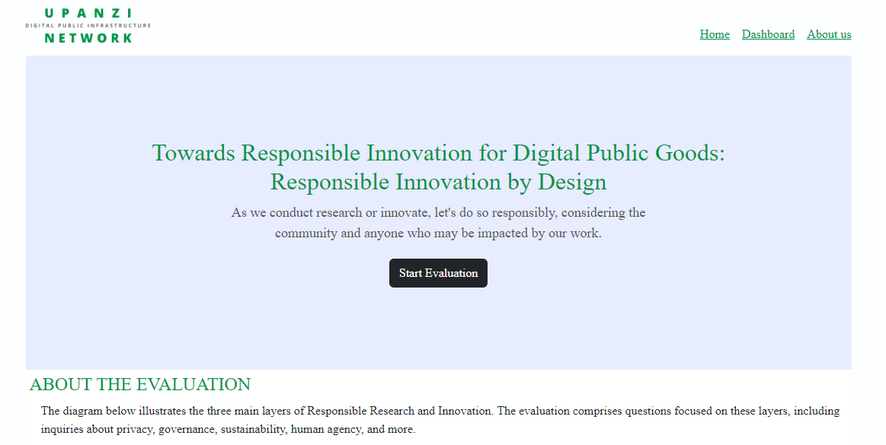
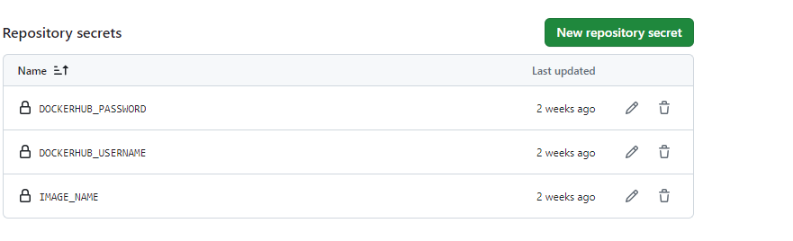

Inatll the app
=========================================================
Create a repository for your project 

ex: 
> mkdir rri
> cd rri

Install the app

Frontend

> git clone https://github.com/cylab-africa/RRI_frontend.git

> cd RRI_frontend

Install dependencies 

> npm install

Run the project in dev mode

> npm start


Main components 
=============================================

Deployment 
=======================================================
The app is currently deployed on Mosip cluster and the following instructions assumes that it is still the case

## CREATE GITHUB WORKFLOWS

### 1. In the project root folder 
Create the folder
> mkdir github/workflows
Create yml file 
> touch main.yml

The file content
``` name: Push Docker Image to DockerHub # Deploy
on:
<!-- This triggers the deployment when you push/merge code on the main branch  -->
  push:
    branches: [ main ]
<!-- Some of the jobs  -->
jobs:
  docker-build-image:
    runs-on: ubuntu-latest
    steps:
      -
        name: Set up QEMU
        uses: docker/setup-qemu-action@v2
      -
        name: Set up Docker Buildx
        uses: docker/setup-buildx-action@v2
      -
        name: Login to Docker Hub
        uses: docker/login-action@v2
        <!-- Replace this with your dockerhub account credetials : https://docs.docker.com/docker-id/  -->
        <!-- To get the password, https://hub.docker.com/settings/general -->
        with:
          username: ${{ secrets.DOCKERHUB_USERNAME }}
          password: ${{ secrets.DOCKERHUB_PASSWORD }}
      -
        name: Build and push
        uses: docker/build-push-action@v3
        with:
          push: true
          tags: ${{ secrets.DOCKERHUB_USERNAME }}/${{ secrets.IMAGE_NAME }}:latest  ## Go to latest
```
***Note: You should create a repository first toget the IMAGE_NAME. Ex: 0780000000/test. Here test is the image name***

### 2. Add secretes on github 

- Go to the project repository on github
- Then settings
- Then ***Secretes and variables*** under ***security***
- Add the three variables which are ***DOCKUHUB_PASSWORD***, ***DOCKERHUB_USERNAME***, and ***IMAGE_NAME***



***These will be used by the workflow to create an action on github which will at the end push the app to Hockerhub.***

### 3. Back to the project root folder to create a ***Dockerfile*** for deplyment

> cd ./ 
> touch Dockerfile
The file content
```
# Base image 
FROM node:18-alpine3.15
# Working dir
WORKDIR /usr/src/app


# Copy package.json and package-lock.json to the working directory
COPY package*.json ./

# Install app dependencies
RUN npm install

COPY . .

# Expose 3000
EXPOSE 3000

RUN npm build

RUN npm install -g serve


CMD ["serve", "-s", "bild"]
```
